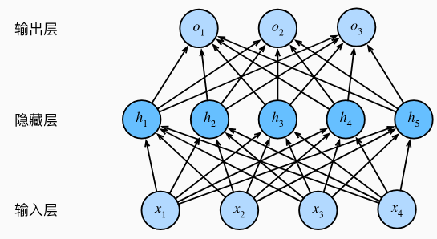
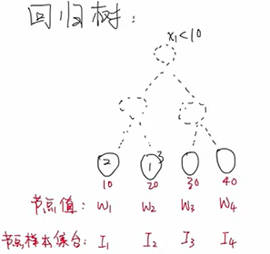
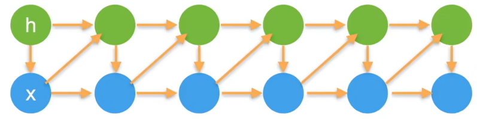
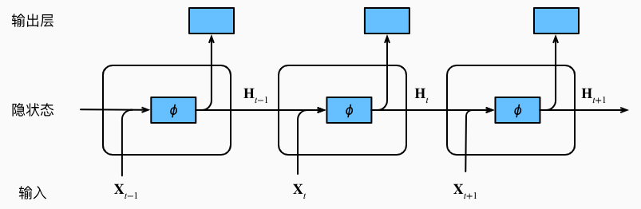
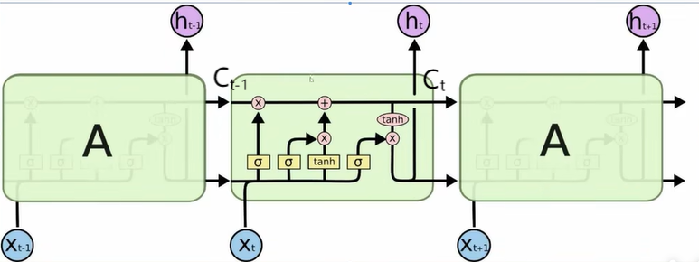

# DL

## 0.数学基础

### 矩阵求导

## 1.数据操作

### 原地操作

运行一些操作可能会导致为新结果分配内存

```python
#记录过去的内存信息
before=id()
Y=Y+X
id(Y)==before

#
False
```

执行原地操作

```python
z=torch.zeros_like(Y)
Z+=Y
Z[:]=X+Y
#上述两种方法不会改变原先Z的内存
```

## 2.数据预处理

读取csv文件，并对其中的数据进行一定的清理工作

### 缺失值处理

## 3.线性神经网络

### 线性回归

$$
y=Xw+b+\epsilon
$$

#### 从零开始

**构造人造数据集**

使用人造数据集的好处是可以有确定的模型训练结果`true_w`和`true_b`

```python
import random
import torch
from d2l import torch as d2l


def synthetic_data(w,b,num_example):
    #生成随机数据集X
    X=torch.normal(0,1,(num_example,len(w)))
    #矩阵乘法
    y=torch.matmul(X,w)+b
    #添加噪声
    y+=torch.normal(0,0.01,y.shape)
    #返回结果
    return X, y.reshape((-1,1))

true_w=torch.tensor([2,-3.4])
true_b=4.2
#针对给出的确定结果值构造人造数据集
features, lables=synthetic_data(true_w,true_b,1000)
```

**获取数据集**

迭代器构造可以理解为返回一个列表

```python
def data_iter(batch_size, features, labels):
    num_examples = len(features)
    indices = list(range(num_examples))
    # 这些样本是随机读取的，没有特定的顺序
    # 打乱索引顺序
    random.shuffle(indices)
    for i in range(0, num_examples, batch_size):
        batch_indices = np.array(
            indices[i: min(i + batch_size, num_examples)])
        yield features[batch_indices], labels[batch_indices]
```

**定义初始化模型参数**

首先给模型设定一个默认参数

```python
w = torch.normal(0, 0.01, size=(2,1), requires_grad=True)
b = torch.zeros(1, requires_grad=True)
```

**定义模型**

用函数进行模型的封装

```python
def linreg(X, w, b):  
    return torch.matmul(X, w) + b
```

**定义损失函数**

```python
def squared_loss(y_hat, y):  
    """均方损失"""
    return (y_hat - y.reshape(y_hat.shape)) ** 2 / 2
```

**定义优化算法**

```python
def sgd(params, lr, batch_size):  
    """小批量随机梯度下降"""
    with torch.no_grad():
        for param in params:
            """把平均化放到这一步不影响结果"""
            param -= lr * param.grad / batch_size
            param.grad.zero_()
```

**训练过程**

```python
#设置学习率
lr = 0.03
#扫三遍
num_epochs = 3
net = linreg
loss = squared_loss

for epoch in range(num_epochs):
    for X, y in data_iter(batch_size, features, labels):
        l = loss(net(X, w, b), y)  # X和y的小批量损失
        # 因为l形状是(batch_size,1)，而不是一个标量。l中的所有元素被加到一起，
        # 并以此计算关于[w,b]的梯度
        l.sum().backward()
        sgd([w, b], lr, batch_size)  # 使用参数的梯度更新参数
    with torch.no_grad():
        train_l = loss(net(features, w, b), labels)
        print(f'epoch {epoch + 1}, loss {float(train_l.mean()):f}')
```

#### 简洁实现

**调用api生成数据集**

```python
import numpy as np
import torch
from torch.utils import data
from d2l import torch as d2l

true_w = torch.tensor([2, -3.4])
true_b = 4.2
features, labels = d2l.synthetic_data(true_w, true_b, 1000)
```

**读取数据集**

调用`data.DataLoader`api构造数据迭代器

`shuffle`参数用于表示是否希望迭代器在每个迭代周期打乱数据

```python
def load_array(data_arrays, batch_size, is_train=True):  
    """构造一个PyTorch数据迭代器"""
    dataset = data.TensorDataset(*data_arrays)
    return data.DataLoader(dataset, batch_size, shuffle=is_train)

batch_size = 10
data_iter = load_array((features, labels), batch_size)
```

**定义模型**

`torch.nn.Linear(in_features, out_features, bias=True)`

`in_features`:输入特征数量

`out_features`:输出特征数量

```python
# nn是神经网络的缩写
from torch import nn
net = nn.Sequential(nn.Linear(2, 1))
```

**初始化模型参数**

指定每个权重参数从均值为0，标准差为0.01的正态分布中随机取样

```python
net[0].weight.data.normal_(0, 0.01)
net[0].bias.data.fill_(0)
```

**定义损失函数,优化算法**

```python
#loss返回的是损失的平均值
loss = nn.MSELoss()
trainer = torch.optim.SGD(net.parameters(), lr=0.03)
```

**训练模型**

```python
num_epochs = 3
for epoch in range(num_epochs):
    for X, y in data_iter:
        l = loss(net(X) ,y)
        trainer.zero_grad()
        l.backward()
        trainer.step()
    l = loss(net(features), labels)
    print(f'epoch {epoch + 1}, loss {l:f}')
```

### SoftMax回归

- 回归估计一个连续值
- 分类预测一个离散值

分类问题从单输出变成了多输出，输出个数等于类别个数

**输入**：对类别进行`one-hot`编码
$$
\mathbf{y} = \begin{bmatrix} y_1, y_2, \dots, y_n \end{bmatrix}^T


\\
y_i =
\begin{cases} 
1 & \text{if } i = y, \\
0 & \text{otherwise.}
\end{cases}
$$
**输出**：输出匹配概率
$$
\hat{\mathbf{y}} = \text{softmax}(\mathbf{o})

\\

\hat{y}_i = \frac{\exp(o_i)}{\sum_k \exp(o_k)}
$$
**交叉熵损失**
$$
H(\mathbf{p}, \mathbf{q}) = \sum_i -p_i \log(q_i)
\\
l(\mathbf{y}, \hat{\mathbf{y}}) = -\sum_i y_i \log(\hat{y}_i) = -\log(\hat{y}_y)
\\
$$

## 4.多层感知机

实际上就是神经网络



非线性激活函数$\sigma$

**隐藏层**：$H=\sigma(XW^{(1)}+b^{(1)})$

**输出层**：$O=HW^{(2)}+b^{(2)}$

### 4.1程序实现

#### 从零开始

**读取数据集**

```python
import torch
from torch import nn
from d2l import torch as d2l

batch_size = 256
train_iter, test_iter = d2l.load_data_fashion_mnist(batch_size)
```

**初始化模型参数**

每个图像有28*28=784个灰度像素值，相当于输入层有784个特征

分类一共有10个种类，相当于输出层有10个值

我们要为损失函数关于参数的梯度分配内存

```python
num_inputs, num_outputs, num_hiddens = 784, 10, 256

W1 = nn.Parameter(torch.randn(
    num_inputs, num_hiddens, requires_grad=True) * 0.01)
b1 = nn.Parameter(torch.zeros(num_hiddens, requires_grad=True))
W2 = nn.Parameter(torch.randn(
    num_hiddens, num_outputs, requires_grad=True) * 0.01)
b2 = nn.Parameter(torch.zeros(num_outputs, requires_grad=True))

params = [W1, b1, W2, b2]
```

**实现ReLU函数**
$$
\text{ReLU}(x) = \max(0, x)
$$

```python
def relu(X):
    a = torch.zeros_like(X)
    return torch.max(X, a)
```

**模型实现**

```python
def net(X):
    #-1可以自动计算转换后的行数
    X = X.reshape((-1, num_inputs))
    H = relu(X@W1 + b1)  # 这里“@”代表矩阵乘法
    return (H@W2 + b2)
```

**损失函数**

```python
loss = nn.CrossEntropyLoss(reduction='none')
```

**训练**

```python
num_epochs, lr = 10, 0.1
updater = torch.optim.SGD(params, lr=lr)
d2l.train_ch3(net, train_iter, test_iter, loss, num_epochs, updater
```

#### 简洁实现

**模型构建**

```python
net = nn.Sequential(nn.Flatten(),
                    nn.Linear(784, 256),
                    nn.ReLU(),
                    nn.Linear(256, 10))

def init_weights(m):
    if type(m) == nn.Linear:
        nn.init.normal_(m.weight, std=0.01)

net.apply(init_weights);
```

**模型训练**

```python
batch_size, lr, num_epochs = 256, 0.1, 10
loss = nn.CrossEntropyLoss(reduction='none')
trainer = torch.optim.SGD(net.parameters(), lr=lr)

train_iter, test_iter = d2l.load_data_fashion_mnist(batch_size)
d2l.train_ch3(net, train_iter, test_iter, loss, num_epochs, trainer)
```

### 4.2模型选择

**训练误差**：模型在训练数据集上计算得到的误差，实际实验中并不怎么被关心

**泛化误差**：模型运用在同样从原始样本的分布中抽取的无限多数据样本时，模型误差的期望

**训练数据集**：==训练模型参数==

**验证数据集**：用来评估模型好坏的数据集，==选择模型超参数==

**测试数据集**：只使用一次的数据集

#### K-则交叉验证

在没有足够多数据时使用这种方法

- 将训练数据分割成K块
- 对于K块数据，依次用第i块数据作为验证集，其他数据块作为训练集训练模型
- 报告K个验证集误差的平均

### 4.3过拟合和欠拟合

#### 模型容量

模型的复杂度(参数的个数，参数值的选择范围)

- 指模型拟合各种函数的能力
- 低容量的模型难以拟合训练数据
- 高容量的模型可以记住所有的训练数据

#### 权重衰退

用于处理过拟合

- 通过限制参数值的选择范围来控制模型容量(==防止模型参数过大==)

$$
\min \ell(w, b) \quad \text{subject to} \quad \|w\|^2 \leq \theta
$$

- 通常不限制偏移`b`
- 小的θ意味着更强的正则项

上式的约束条件运用拉格朗日定理，也可以等价于
$$
\min \ell(w, b) + \frac{\lambda}{2} \|w\|^2
$$
计算梯度：
$$
\frac{\partial}{\partial \mathbf{w}} \left( \ell(\mathbf{w}, b) + \frac{\lambda}{2} \|\mathbf{w}\|^2 \right) = \frac{\partial \ell(\mathbf{w}, b)}{\partial \mathbf{w}} + \lambda \mathbf{w}
\
$$
更新参数：
$$
\mathbf{w}_{t+1} = (1 - \eta \lambda) \mathbf{w}_t - \eta \frac{\partial \ell(\mathbf{w}_t, b_t)}{\partial \mathbf{w}_t}
$$

#### 丢弃法

- 将一些输出项随机置0来控制模型复杂度
- 作用在隐藏层上
- 丢弃概率`p`是模型的超参数

#### 数值稳定性

## 5.深度学习计算

### 5.1层与块


**块(block)**：可以描述单个层,由多个层组成的组件或整个模型

`nn.Sequential`：定义了一个特殊的`Module`，维护了一个由`Module`组成的有序列表

`nn.Linear`：`Module`的子类

`net(X)`:实际上调用执行了`net.__call__(X)`,将列表中的每一块都连接在一起，前一块的输出作为后一块的输入

==如何自定义一个块？==

继承`Module`模块，我们只需要定义初始化函数`__init__()`和前向传播函数`forward()`

```python
class MLP(nn.Module):
    # 用模型参数声明层。这里，我们声明两个全连接的层
    def __init__(self):
        # 调用MLP的父类Module的构造函数来执行必要的初始化。
        # 这样，在类实例化时也可以指定其他函数参数，例如模型参数params（稍后将介绍）
        super().__init__()
        self.hidden = nn.Linear(20, 256)  # 隐藏层
        self.out = nn.Linear(256, 10)  # 输出层

    # 定义模型的前向传播，即如何根据输入X返回所需的模型输出
    def forward(self, X):
        # 注意，这里我们使用ReLU的函数版本，其在nn.functional模块中定义。
        return self.out(F.relu(self.hidden(X)))
```

### 5.2参数管理

```python
net = nn.Sequential(nn.Linear(4, 8), nn.ReLU(), nn.Linear(8, 1))
print(net[2].state_dict())
```

如上操作会打印两个参数，分别是`weight`和`bias`

`weight.shape()`=(8,4)

`nn.Linear`的计算过程如下
$$
H=XW_{1}^{T}+b_1
$$

#### 参数初始化

**内置初始化**

将所有权重参数初始化为标准差为0.01的高斯随机变量， 且将偏置参数设置为0

```python
def init_normal(m):
    if type(m) == nn.Linear:
        nn.init.normal_(m.weight, mean=0, std=0.01)
        nn.init.zeros_(m.bias)
net.apply(init_normal)
```

对不同的块运用不同的初始化方法

```python
def init_xavier(m):
    if type(m) == nn.Linear:
        nn.init.xavier_uniform_(m.weight)
def init_42(m):
    if type(m) == nn.Linear:
        nn.init.constant_(m.weight, 42)

net[0].apply(init_xavier)
net[2].apply(init_42)
```

#### 参数绑定

### 5.3自定义层

构造一个没有任何参数的自定义层

### 5.4读写文件

#### 加载和保存张量

**保存张量**

调用`torch.save()`

```python
x = torch.arange(4)
torch.save(x, 'x-file')
```

**读取张量**

调用`torch.load()`

```python
mydict = {'x': x, 'y': y}
torch.save(mydict, 'mydict')
mydict2 = torch.load('mydict')
```


#### 加载和保存模型参数

模型保存的过程不是保存整个模型而是保存模型的参数，==参数比较容易序列化，模型难以序列化==

调用`torch.save()`

```python
class MLP(nn.Module):
    def __init__(self):
        super().__init__()
        self.hidden = nn.Linear(20, 256)
        self.output = nn.Linear(256, 10)

    def forward(self, x):
        return self.output(F.relu(self.hidden(x)))

net = MLP()
X = torch.randn(size=(2, 20))
Y = net(X)
#保存模型参数
torch.save(net.state_dict(), 'mlp.params')
```

加载模型参数

```python
clone = MLP()
clone.load_state_dict(torch.load('mlp.params'))
clone.eval()
```


### 5.5GPU

#### 计算设备

两个方便的函数，允许我们比较轻松地指定张量创建的位置

```python
def try_gpu(i=0):  #@save
    """如果存在，则返回gpu(i)，否则返回cpu()"""
    if torch.cuda.device_count() >= i + 1:
        return torch.device(f'cuda:{i}')
    return torch.device('cpu')

def try_all_gpus():  #@save
    """返回所有可用的GPU，如果没有GPU，则返回[cpu(),]"""
    devices = [torch.device(f'cuda:{i}')
             for i in range(torch.cuda.device_count())]
    return devices if devices else [torch.device('cpu')]
```

#### 张量与GPU

## 6.树模型

### 回归树

用决策树模型解决回归问题,每一片叶子输出一个预测值，预测值为该片叶子所含训练集元素输出的均值

**CART(Classification And Regression Tree)**



$I$是样本ID的集合

$I_j=\{i|q(x_i)=j\}$

$q(x_i)$表示传入的特征序列属于哪一个样本集合

$f(x_i)=W_{q(x_i)}$

### XGboost

#### 模型表示

模型设置有M棵树，M棵树的回归结果相加就是我们的预测值
$$
\hat{y}_i^{(M)} = \sum_{j=1}^M f_j(x_i) = \sum_{j=1}^{M-1} f_j(x_i) + f_j^{(M)}(x_i)
$$

$$
\hat{y}_i^{(m)}=\hat{y}_i^{(m-1)}+f_{m}(x_i)
$$

#### 优化目标

$$
Object^{(m)} = \sum_{i=1}^n L\left(y_i, \hat{y}_{i}^{(m)}\right) + \sum_{j=1}^m \Omega(f_j)
$$

**正则化项**
$$
\Omega(f_m) = \gamma T + \frac{1}{2} \lambda \sum_{j=1}^T w_j^2
$$
$\gamma$：超参数

$\lambda$：超参数

$T$：当前$f_t$所代表回归树的叶子节点个数

$w_j$：当前这颗树第j个叶子节点的权值

==**前向分布算法决定了**==

$Object^{(m)}$优化时的正则项只与$\Omega(f_m)$有关


**损失项**

我们将预测误差分配到当前每个叶子节点
$$
\sum_{i=1}^n L\left(y_i, \hat{y}_{i}^{(m)}\right)=\sum_{j=1}^{T}\sum_{i\in I_j}L(y_i,\hat{y}_{i}^{(m)})
$$

$$
Obj^{(m)} = \gamma T + \sum_{j=1}^T \left[ \sum_{i \in I_j} L\left(y_i, \hat{y}_i^{(m-1)} + w_j \right)  + \frac{\lambda}{2} w_j^2\right]
$$

我们的目标就是找到$w_j$的最优解


**泰勒二阶展开**

不同的任务意味着不同的损失函数$L$

我们只能用抽象符号去描述$L$,但不能详细描述$L$

我们用泰勒公式对$L$进行展开
$$
f(x) \approx f(x_0) + f'(x_0)(x - x_0) + \frac{1}{2} f''(x_0)(x - x_0)^2
$$

$$
f(w_j)=L(y_i, \hat{y}_i^{(m-1)} + w_j) \approx L'(y_i, \hat{y}_i^{(m-1)}) w_j + \frac{1}{2} L''(y_i, \hat{y}_i^{(m-1)}) w_j^2
$$

$$
L(y_i, \hat{y}_i^{(m-1)} + w_j) \approx g_iw_j + \frac{1}{2}h_iw_j^2
$$

于是我们又可以改写$Obj$
$$
Obj^{(m)}=\gamma T + \sum_{j=1}^T \left( w_j G_j + \frac{1}{2} w_j^2 (\lambda + H_j) \right)
$$

$$
G_j=\sum_{i \in I_j}g_i
$$

$$
H_j=\sum_{i\in I_j}h_i
$$


**最优解**
$$
w_j^*=-\frac{G_j}{H_j+\lambda}
$$

$$
Obj^{(m)*} = \min Obj^{(m)} = \gamma T - \frac{1}{2} \sum_{j=1}^T \frac{G_j^2}{H_j + \lambda}
$$


#### 树的结构

优化关注点是叶子节点，但我们需要知道每棵树的上层结构

**精确贪心算法**

对于每棵树来说,由一个节点分裂成两个节点

$T_前$=1 $T_后$=2
$$
gain=Obj^{*}_前-Obj^{*}_后
\\
=\frac{1}{2} \left[ \frac{G_L^2}{H_L + \lambda} + \frac{G_R^2}{H_R + \lambda} - \frac{(G_L + G_R)^2}{H_L + H_R + \lambda} \right] - \gamma
$$
==停止条件==：

- `max gain`<=$10^{-5}$
- 叶子节点包含样本个数<=1
- 超参数设置层级，叶子节点数

## 8.循环神经网络

### 8.1序列模型

实际中很多数据是有时序结构的

在时间$t$观察到$x_t$，那么得到$T$个不独立的随机变量

$(x_1,...x_T) \sim p(x)$

使用条件概率展开

$p(a,b)=p(a)p(b|a)=p(b)p(a|b)$

$p(\mathbf{x}) = p(x_1) \cdot p(x_2 \mid x_1) \cdot p(x_3 \mid x_1, x_2) \cdot \dots \cdot p(x_T \mid x_1, \dots, x_{T-1})$

我们的目标是对于下面的条件概率建模
$$
p(x_t \mid x_1, \dots, x_{t-1}) = p(x_t \mid f(x_1, \dots, x_{t-1}))
$$

#### **方案A-马尔科夫假设**

- 假设当前数据只跟$\tau$个过去数据点相关

$$
p(x_t \mid x_1, \dots, x_{t-1}) = p(x_t \mid x_{t-\tau}, \dots, x_{t-1})
$$

**step1 生成数据**

使用正弦函数和一些可加性噪声来生成序列数据

时间步为1，2，...,1000

```python
import torch
from torch import nn
from d2l import torch as d2l

T = 1000  # 总共产生1000个点
time = torch.arange(1, T + 1, dtype=torch.float32)
# x=sin(0.01*time)+noise
x = torch.sin(0.01 * time) + torch.normal(0, 0.2, (T,))
```

**step2 ** **数据转换**

将数据映射为数据对$y_t=x_t$    $y_t \sim x_t=[x_{t-\tau},...,x_{t-1}]$

生成数据迭代器`train_iter`

```python
tau = 4
# 由于我们有步长限制，我们的特征集有T-tau行，每行tau个特征
features = torch.zeros((T - tau, tau))
for i in range(tau):
    features[:, i] = x[i: T - tau + i]
# label等于x[tau:]
labels = x[tau:].reshape((-1, 1))

batch_size, n_train = 16, 600
# 只有前n_train个样本用于训练
train_iter = d2l.load_array((features[:n_train], labels[:n_train]),
                            batch_size, is_train=True)
```

**step3 定义模型架构**

定义初始化权重函数`init_weights()`

定义网络模型`get_net()`

```python
# 初始化网络权重的函数
def init_weights(m):
    if type(m) == nn.Linear:
        nn.init.xavier_uniform_(m.weight)

# 一个简单的多层感知机
def get_net():
    net = nn.Sequential(nn.Linear(4, 10),
                        nn.ReLU(),
                        nn.Linear(10, 1))
    net.apply(init_weights)
    return net

# 平方损失。注意：MSELoss计算平方误差时不带系数1/2
loss = nn.MSELoss(reduction='none')
```

**step4 模型训练**

```python
def train(net, train_iter, loss, epochs, lr):
    trainer = torch.optim.Adam(net.parameters(), lr)
    for epoch in range(epochs):
        for X, y in train_iter:
            trainer.zero_grad()
            l = loss(net(X), y)
            l.sum().backward()
            trainer.step()
        print(f'epoch {epoch + 1}, '
              f'loss: {d2l.evaluate_loss(net, train_iter, loss):f}')

net = get_net()
train(net, train_iter, loss, 5, 0.01)
```

==1000个样例，如果用600个进行训练，400个进行验证，模型拟合效果会非常好==

==但如果我们只有600个样例，要我们去预测未来400个结果，那么模型将会失效==

#### **方案B-潜变量模型**

- 引入潜变量$h_t$来表示过去信息$h_t=f(x_1,...x_{t-1})$
- $x_t=p(x_t|h_t)$



### 8.2 RNN

考虑潜变量模型



激活函数通常使用`tanh`
$$
H_t=\sigma(X_tW_{xh}+H_{t-1}W_{hh}+b_h) \\
Y_t=H_tW_{hq}+b_q
$$
同样RNN也存在梯度爆炸和梯度消失的问题
$$
\Delta W_x = -\eta \cdot \frac{\partial S}{\partial Y_{\text{predict}}} \cdot \frac{\partial Y_{\text{predict}}}{\partial H_k} \cdot \frac{\partial H_k}{\partial H_{k-1}} \cdot \frac{\partial H_{k-1}}{\partial H_{k-2}} \cdot \dots \cdot \frac{\partial H_2}{\partial H_1} \cdot \frac{\partial H_1}{\partial W}
$$

$$
\frac{\partial H_k}{\partial H_{k-1}} = \tanh'\left(w_x x_k + w_h H_{k-1} + b\right) \cdot w_h
$$

### 8.3 LSTM

